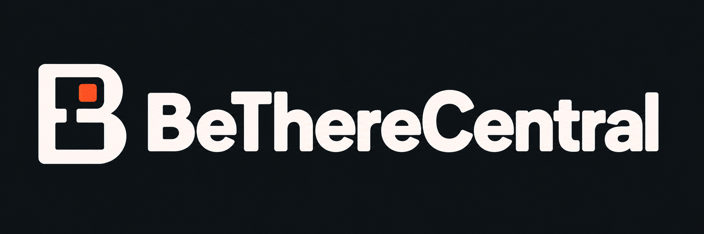
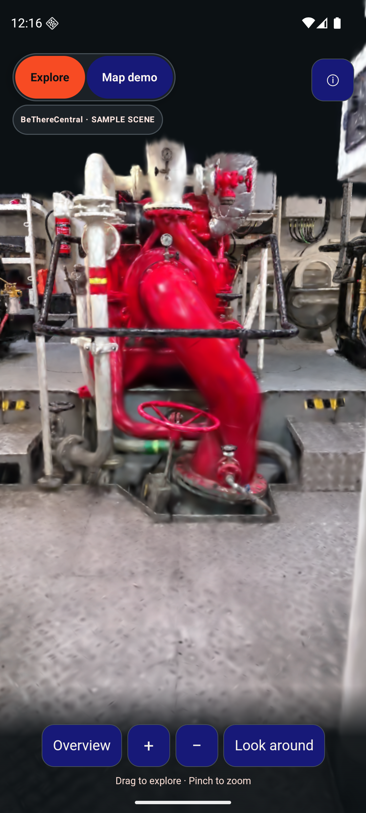
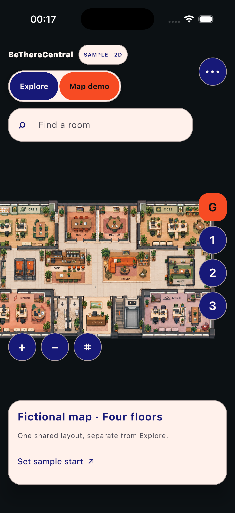
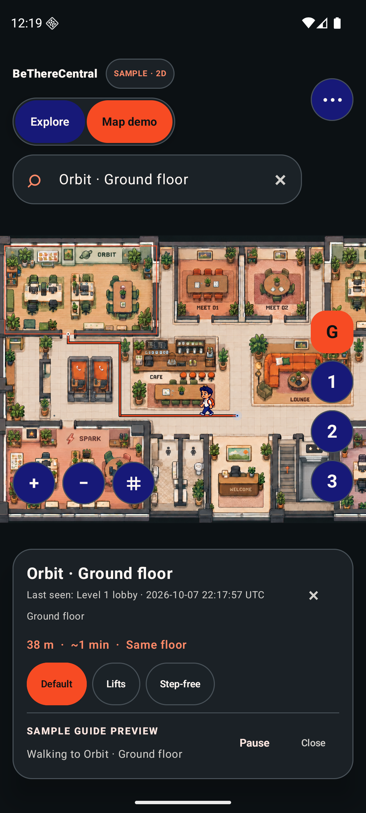

# BeThereCentral



[Logo and generation notes](docs/brand/README.md)

**Make an unfamiliar building feel familiar—and enjoyable to explore.**

BeThereCentral is an open-source spatial exploration and indoor navigation experiment. Its mobile app pairs a real interactive Gaussian-splat Explore view with a separate 2D map for navigation and accessibility. Android and iOS share Kotlin code and a Compose Multiplatform interface; a desktop preview makes the project easier to explore and contribute to.

Built for a proposed BeCentral experience by a WeAreFounders participant. Its visual direction draws from the [BeCentral](https://www.becentral.org/) and [WeAreFounders](https://www.becentral.org/programs/we-are-founders) websites; it is not presented as an officially approved campus service.

**Current stage: runnable sample prototype.** Explore renders a licensed engine-room scene from another location; it has no room hotspots or routes. No real floor plans or positioning hardware have been supplied for the proposed building. All mapped rooms and routes are fictional. A checkpoint records where you were **last seen**; it does not continuously track you.

[Product requirements](docs/PRD.md) · [Architecture](docs/ARCHITECTURE.md) · [Experience standards](docs/EXPERIENCE.md) · [Building-team demo](docs/DEMO.md) · [Privacy](docs/PRIVACY.md) · [Contributing](CONTRIBUTING.md) · [Backlog](docs/BACKLOG.md) · [Verified checks](docs/testing/STATUS.md)

## Designed for immersive exploration and clear navigation

Explore is the mobile opening view. It renders 650,000 Gaussian splats locally, with orbit, pan, zoom and Overview controls, loading/error states and clear attribution. **Map demo** remains one tap away for search, routes and step-free choices. The app keeps route, QR, hunt and local sharing state when switching views.

Soft charcoal surroundings keep the space in focus. BeCentral blue, orange and peach accents, Material 3 Expressive-inspired controls and an edge-to-edge canvas frame the experience; controls remain clear of system bars and gestures. The separate map uses the approved furnished coworking-floor artwork and a tiny founder guide with an orange backpack.

Choose **Light panels** or **Dark panels** in the map's **More options** menu. Both keep a charcoal map canvas so the pixel-art floor stays in focus. Light panels pair warm white and peach with navy text; Dark panels use dark surfaces. The choice lasts for the app session and preserves your route when switching floors or visiting Explore. Explore keeps its dark scene presentation.

This direction takes inspiration from the spatial focus of the supplied [Matterport experience](https://my.matterport.com/show/?m=RFxTxqcbUTB). BeThereCentral does not embed that tour or copy its assets. The viewer uses the [CC BY 4.0 Tugboat Bat engine-room sample](exploration/README.md), reduced and bundled for this prototype; it is unrelated to the fictional map and any proposed building. See the [interface decision](docs/adr/0003-map-first-interface.md) and [Explore decision](docs/adr/0004-gaussian-exploration-priority.md).



*Actual Android emulator capture. [Zoomed-out exterior view](docs/screenshots/android-splat-zoom-out.png). Physical Fold appearance and performance require separate confirmation.*



*Actual iOS simulator capture: light panels keep the map environment charcoal.*



*Actual Android emulator capture: fictional geometry, calculated route and optional founder preview. Last seen remains a separate checkpoint observation.*

## What you can try

- Open **Explore** on Android or iOS to move around the separately identified engine-room splat. Orbit, pan, zoom out to see the capture from outside, return to Overview or use Look around; the sample loads from the app bundle without a network service.
- Choose **Map demo** to open the separate fictional building without losing the current route, checkpoint observation, hunt progress or local sharing grant.
- Explore four fictional floors using one illustrated coworking footprint, with company suites, meeting rooms, phone booths, café, lounge and reception; search or tap a room to select a destination. Orbit, Moss, Spark and North are fictional tenants, not a BeCentral directory.
- Pan and zoom the map. Preview calculated routes, inspect floor transitions, and compare stairs/lift and step-free choices.
- Play an optional pixel-art founder guide along the selected sample route. Pause, continue at floor changes, and meet the destination room; the orange-backpack character is a preview, not a tracked person.
- Establish a sample starting point with a simulated QR checkpoint. Positions remain labelled **last seen**.
- Try short-lived sharing consent with sample people and 5, 10 or 15 minutes, then revoke it locally.
- Complete a cooperative checkpoint hunt with sample teammates on the same device.

The prototype is deliberately honest about integration status:

| Capability | What works now | What remains |
| --- | --- | --- |
| Floor maps, search and routes | Shared app logic using fictional geometry and graph data | Real licensed plans, surveyed entrances and accessibility |
| Pixel guide | Optional sample-route preview with walking, explicit floor changes and a sample room introduction | Real campus content and usability validation |
| QR checkpoints | Payload validation and sample/manual checkpoint actions | Camera scanning and on-site checkpoint installation |
| Position | Latest sample checkpoint observation | Continuous indoor positioning and hardware |
| Sharing screen | Local consent, duration and revocation simulation | Sending positions to real people |
| Sharing server | Separate runnable reference: authorized recipients, server-clock expiry, revocation, one latest opaque payload | App connection, production accounts, TLS and operational security |
| End-to-end encryption | Documented protocol requirements and opaque-payload server contract | Client encryption, verified key exchange and independent review |
| Cooperative hunt | Same-device team simulation | Networked team sessions and synchronization |
| Immersive Explore / Gaussian splats | Bundled interactive 650,000-splat sample, rendered in a mobile web surface; browser demo also runs locally | Real building capture, surveyed scene alignment, device performance study and room-linked views |
| Surveyed room-linked captures | Not implemented | Building permission, surveyed captures and verified room/coordinate mapping |

Sample step-free routes are **not surveyed accessibility guidance**. This app is not an emergency evacuation system.

## Run it locally

No application account, API key, backend or positioning hardware is needed for the demo. The first build needs internet access to download Gradle and dependencies.

```sh
git clone https://github.com/e-mric/BeThereCentral.git
cd BeThereCentral
```

### Prerequisites

- **JDK 17** and Git. Set `JAVA_HOME` if your IDE/shell does not find Java.
- **Android SDK platform 36**, installed through Android Studio, for Android builds. Set `ANDROID_HOME` to your SDK directory or add `sdk.dir=/your/sdk/path` to an untracked `local.properties` file.
- **macOS with Xcode and an iOS simulator** for iOS. The checked-in Xcode project targets iOS 16+ and Apple Silicon simulators. An Apple development team is needed for a physical-device build, not an unsigned simulator build.
- **Python 3.9+** to serve the optional browser demo or run the disconnected reference server/tests.

Use the checked-in Gradle wrapper; a separate Gradle installation is unnecessary. On Windows, use `gradlew.bat` in place of `./gradlew`. The app targets Android 8.0/API 26 and later. See [verification status](docs/testing/STATUS.md) for the exact environment used here and remaining device checks.

### Desktop preview

From the repository root:

```sh
./gradlew :composeApp:run
```

This runs the shared 2D Map and domain behavior. Explore opens inside the Android and iOS apps; the desktop app keeps a clear mobile-only label. To present the same bundled sample viewer in a desktop browser, run:

```sh
python3 -m http.server 4173 --bind 127.0.0.1 --directory exploration/dist
```

Open `http://127.0.0.1:4173/`. The server is bound to your own computer, and all scripts and scene data come from `exploration/dist/`. See [scene provenance and build steps](exploration/README.md).

### Android

Open the repository in Android Studio, allow Gradle sync, and run the `androidApp` configuration on an emulator or device. Or build the debug APK:

```sh
./gradlew :androidApp:assembleDebug
```

The APK, including the offline scene, is written to `androidApp/build/outputs/apk/debug/androidApp-debug.apk`. To install on a connected emulator/device:

```sh
./gradlew :androidApp:installDebug
```

### iOS

Open `iosApp/BeThereCentral.xcodeproj` in Xcode, choose the **BeThereCentral** scheme and an iPhone simulator, then Run. The build phase invokes Gradle to create the shared Kotlin framework. The Xcode project is checked in; XcodeGen is only needed if you change `iosApp/project.yml` and regenerate the project.

The iOS build also copies the checked-in offline viewer and scene into the app bundle. The Explore tab renders it in `WKWebView`; the Map demo tab remains available if the viewer cannot run.

Compile the shared simulator framework independently:

```sh
./gradlew :composeApp:linkDebugFrameworkIosSimulatorArm64
```

If Xcode cannot find Java, launch it from a shell with `JAVA_HOME` set or configure its build environment. Intel simulator support is not configured in this initial project.

### Optional reference sharing server

```sh
python3 -m server
```

It binds to loopback and prints temporary demo credentials. **The app does not connect to it.** Use synthetic payloads only. The [server guide](server/README.md) explains requests, authorization, expiry and limits.

## A quick walkthrough

1. On Android or iOS, open directly into **Explore**. The viewer labels its engine room as a separate sample space. Drag to orbit, use two fingers to pan, pinch or use the buttons to zoom, and Overview to recover the starting view.
2. Choose **Map demo**. The **Sample · 2D** indicator identifies the fictional plan; your starting point is initially unset.
3. Use the starting-point action to choose a simulated QR checkpoint, then search for a room or tap it on the map.
4. Compare route preferences and inspect floor transitions. Changing floors never moves your last-seen position. Switching back to Explore does not erase the map session.
5. Open the secondary feature menu to try **QR hunt** and **People**. Their panels describe the local simulation status.

The app keeps demo state in memory. Restarting resets it; no location history is saved by default.

The founder and approved coworking-floor background are original GPT-generated pixel-art assets bundled offline. Searchable room boundaries and route waypoints are registered to the artwork; the image does not determine routing. All four floors reuse the same sample footprint and illustrative scale. See [asset provenance](docs/assets/PIXEL_ART.md) for source files, generation notes and checksums.

## How it is built

Kotlin Multiplatform shares feature behavior across platforms. Compose Multiplatform renders the interface. Thin Android, iOS and desktop launchers host it. Feature domain logic does not depend on UI or network transport.

```text
exploration/                  # Licensed sample, bundled viewer, browser tests and provenance
composeApp/
  src/commonMain/kotlin/com/betherecentral/
    features/                 # Exploration, building, routing, guide, checkpoints, sharing, hunt
  src/commonTest/              # Tests mirror the feature packages
  src/desktopMain/             # Desktop entry point
  src/iosMain/                 # Compose UIViewController
androidApp/                   # Android application and activity
iosApp/                       # SwiftUI host and checked-in Xcode project
server/sharing/               # Disconnected reference sharing service
server/tests/sharing/         # Grant behavior and HTTP integration tests
docs/                         # PRD, architecture, privacy, decisions, test evidence
.agents/skills/               # Selected, licensed Matt Pocock engineering skills
```

Within a feature, `domain` owns rules, `data` supplies sample implementations, and `presentation` renders state where those layers are useful. We avoid empty layers and forwarding classes. The Explore presentation has thin Android `WebView` and iOS `WKWebView` adapters over the same offline viewer; it does not add building-room IDs to the unrelated scene. Platform source sets are separate because Kotlin's build system requires them; tests still live in the matching feature package.

The reference server is a small Python standard-library experiment, not a second app architecture. It makes expiry and recipient checks independently executable without adding a deployment stack. A production adapter is a later decision.

Versions are pinned in the Gradle build files. The initial stack is Kotlin 2.3.20, Compose Multiplatform 1.11.1, Android Gradle Plugin 9.3.1 and Gradle 9.5.0. Material 3 is pinned separately; see [architecture](docs/ARCHITECTURE.md) for the dependency rationale and limitations.

## Tests and quality

Run shared feature tests on the JVM and build Android:

```sh
./gradlew :composeApp:desktopTest :androidApp:assembleDebug
python3 -m unittest discover -s server/tests -t . -v
```

The viewer has a separate build and test workflow in [exploration/README.md](exploration/README.md), covering camera behavior, sample integrity and complete bundles.

Tests focus on observable behavior: route validity and connector choices, step-free exclusions, checkpoint rejection, hunt progress, consent duration, recipient isolation and expiry/revocation. The reference server suite includes real loopback HTTP requests and an injected server clock, so exact-deadline tests do not wait fifteen minutes.

Build success is not the same as device validation. [Verification status](docs/testing/STATUS.md) records what was actually built, tested and launched, plus what remains. CI configuration is included for GitHub; a hosted CI pass is only claimed after it has run.

Every behavior change should update its feature tests, relevant documentation and the [changelog](CHANGELOG.md) in the same pull request. Accessibility, camera integration, production sharing and actual building accuracy have explicit release gates.

## How agents help

The project uses a deliberate division of work:

| Role | Model | Responsibility |
| --- | --- | --- |
| Planner and reviewer | Astra (`gpt-6-astra`) | Challenge scope, identify risks, review architecture and acceptance criteria |
| Orchestrator | Sol (`gpt-6-sol`) | Break work into bounded tasks, coordinate interfaces, integrate and verify |
| Executor | Luna (`gpt-6-luna`) | Implement focused features and tests with clear ownership |

These are development roles, not agents embedded in the app. The app does not call an LLM or require an AI subscription to run. A human contributor can build and modify everything with the same documented tools.

[AGENTS.md](AGENTS.md) defines repository rules: feature ownership, privacy boundaries, documentation updates and honest verification. Selected skills from [Matt Pocock's skills](https://github.com/mattpocock/skills) are vendored with provenance and license: **codebase-design**, **tdd**, **code-review** and **setup-matt-pocock-skills**. They support development rather than becoming runtime dependencies. See [skill setup](docs/agents/SKILLS.md) for what was installed and consulted.

Agents must read the relevant skill before using it, respect user authorization, and report unavailable tools/models honestly. They should not publish issues, comments or private data without authorization. A generated change still needs tests and review. The [experience standards](docs/EXPERIENCE.md) define the complete demo journey and its visual acceptance checks: builds and renderer-ready logs do not prove that a user can see or use the scene. Astra reviews the journey and screenshots as well as code; Sol integrates the result, and Luna implements bounded changes.

## Build, measure, learn

The interactive sample viewer is now built, and its CC BY 4.0 source, transformation and bundled files are documented in [exploration/README.md](exploration/README.md). It is a prototype choice for this milestone, not proof that a web surface is the final renderer for every device. Measure load time, first frame and memory on named Android/iOS hardware before setting performance budgets. A later, permitted and surveyed capture could connect immersive scenes to building navigation through the [building coordinate and room-ID contract](docs/COORDINATES.md).

Navigation studies remain useful for improving routes and last-seen comprehension, while immersive exploration is a core experience and does not wait on navigation-study results.

## Contribute and publish

Start with [CONTRIBUTING.md](CONTRIBUTING.md) and pick a small item from the [backlog](docs/BACKLOG.md). Documentation, accessibility feedback and tests are welcome alongside code.

The source repository is [e-mric/BeThereCentral](https://github.com/e-mric/BeThereCentral). The local backlog remains the working roadmap; GitHub Issues can host agreed work as the community grows. CI is configured for pushes and pull requests. This sample is not an app-store release.

**Next milestone: Room Studio.** A separate editor will let tenants propose room decorations, pixel-style logos and furniture within assigned spaces. The current milestone finishes and publishes the app; the editor is planned, not implemented.

Project code is released under the [MIT license](LICENSE). The bundled scene retains its separate [CC BY 4.0 attribution and licence](exploration/public/SCENE-LICENSE.txt). Vendored skills retain their [upstream notice](.agents/skills/LICENSE.mattpocock). For security boundaries and reporting setup, read [SECURITY.md](SECURITY.md).
