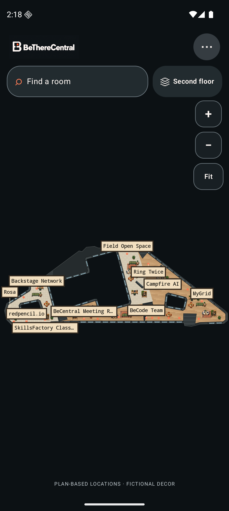

# BeThereCentral


[Logo and generation notes](docs/brand/README.md)

**Make an unfamiliar building feel familiar—and enjoyable to explore.**

BeThereCentral is an open-source community game and learning platform being built iteratively by a WeAreFounders participant. The current development work improves the BeCentral map and its reusable pixel-art assets while keeping company positions faithful to the supplied plans. The active app home is a pixel-art world built around five schematic plans, from ground through fourth floor. Each floor follows its own approximate source outline and courtyard shape. Courtyards remain empty dark voids; on ground, the full building silhouette remains visible in muted charcoal while the unassigned grey source area has no furniture. Interior lines are traced from the supplied schematics; furniture and window styling remain fictional decoration. Search source-listed company names and plan numbers, pan and zoom, and use the legend for the unplaced entry. The plan revision and survey accuracy are unconfirmed. The map is under active development; it is not an officially approved campus service, measured route map or live positioning app.

Android and iOS share Kotlin behavior and a Compose Multiplatform interface; a desktop preview supports development. The earlier fictional route, guide, QR, sharing and hunt examples are retained as internal legacy fixtures and tests, not integrated with the five plans. A licensed interactive Gaussian-splat engine room remains a separate browser experiment; it does not depict BeCentral.

[Product requirements](docs/PRD.md) · [Architecture](docs/ARCHITECTURE.md) · [Experience standards](docs/EXPERIENCE.md) · [Building-team demo](docs/DEMO.md) · [Coordinates](docs/COORDINATES.md) · [Plan-world decision](docs/adr/0006-plan-derived-pixel-world.md) · [Privacy](docs/PRIVACY.md) · [Backlog](docs/BACKLOG.md) · [Verified checks](docs/testing/STATUS.md)

## Planned direction, implementation on hold

The selected next direction is **Godot for the game and SvelteKit for browser Studio**, with rooms, characters and learning quests exchanged as versioned content. The current Compose app remains the map implementation; the Vite/PixiJS editor remains a separate Room Studio prototype. Resident feedback may change the PRD; no migration starts until that feedback is incorporated and the user resumes implementation. On 9 October, the user separately resumed existing-map asset work, converting all five floors to authored modular recipes; this does not resume the game or Studio migration. See the [phased plan](docs/plans/GODOT_SVELTEKIT.md) and [ADR 0008](docs/adr/0008-godot-game-sveltekit-studio.md), including the Compose-for-web alternative.

## What the current app shows

Each of the five floors has its own authored modular scene, drawn by a shared renderer and clipped to a source-derived outer footprint. Company markers match the supplied plan's badge centers and repeat at each source position; a marker is still only a source-image reference, not a surveyed room location. These masks preserve approximate relative proportions and courtyard openings remain empty dark voids. The ground-floor silhouette is shown in muted charcoal (#252B2D) with a subtle outline; illustration is confined to known colored regions, leaving unassigned grey source areas plain and unfurnished. The bike-parking icon sits in its separate source room west of the lobby. Interior partition lines and stair marks are traced from the supplied schematics. Desks, furniture, windows and characters are fictional. The source drawings are 2048 × 1448 pixels, with X right and Y down. Their coordinates are drawing references, not metres, walking distances, entrances or step-free paths. Pan, zoom and Fit help inspect a floor. Search and the legend expose source-listed names and numbers, including The Sky, which has no source marker. See the [company placement audit](docs/assets/COMPANY_PLACEMENT_AUDIT.md) for all five floors.

Try **Campfire AI** on the second floor and **42 Belgium** on the third. On the fourth, **The Sky** appears as number **66** in the legend without a guessed map marker. Ground-floor grey/orange and second-floor grey source areas have no confirmed occupant assignment; the ground grey area is left without furniture. The first-floor FARI shape is depicted as detached, with no assumed connection. A compact pixel host uses only source-supported facts, never fictional tenant missions. A repeated plan number belongs to one place even if the plan draws it at several approximate anchors.

All five floors now use authored reusable material, wall/window and furniture placements through the same modular renderer. The original full-floor images remain historical references and are not loaded as active art or fallback. Source-derived footprint masks determine where floor art appears; unassigned grey source areas stay plain, including the ground grey region within its visible silhouette, and courtyard voids remain empty. Directory records preserve names and plan positions; repeated names and leader lines keep markers readable as the map zooms, and offscreen labels are omitted. The scene data is editable in source, not through an in-app floor editor. Source linework is kept independent of decoration, and conflicting furniture is omitted. Neither the schematic lines nor the artwork form a surveyed room inventory or a route graph. Toilet positions remain pending user input. No route, QR scan, sharing, team session, backend, analytics or external location upload is connected to this plan world. It is not emergency or accessibility guidance. See [source and art provenance](docs/assets/PIXEL_ART.md) and the [current demo](docs/DEMO.md).

Earlier screenshots in [docs/screenshots](docs/screenshots/README.md) may show the historical fictional four-floor map or separate sample scene. Check [verification status](docs/testing/STATUS.md) for what has actually rendered on browser, emulator and physical device; a build alone does not establish visual success.



[All five floor captures](docs/screenshots/README.md) · [Original floor artwork and provenance](docs/assets/PIXEL_ART.md)

## Run it locally

No app account, API key, backend or positioning hardware is needed. The first build needs internet access for Gradle dependencies.

```sh
git clone https://github.com/e-mric/BeThereCentral.git
cd BeThereCentral
```

Prerequisites: JDK 17 and Git; Android SDK platform 36 for Android; macOS, Xcode and an iOS simulator for iOS. Set `JAVA_HOME` if Java is not found, and `ANDROID_HOME` or an untracked `local.properties` `sdk.dir` for Android. A physical iOS build needs an Apple development team. Python 3.9+ is only needed for the optional browser viewer and disconnected reference server. Use the checked-in Gradle wrapper; Windows users can use `gradlew.bat`.

### Desktop

```sh
./gradlew :composeApp:run
```

This opens the shared Compose app. To inspect the independent licensed engine-room experiment in a desktop browser:

```sh
python3 -m http.server 4173 --bind 127.0.0.1 --directory exploration/dist
```

Open `http://127.0.0.1:4173/`. It uses local bundled scene files and does not establish alignment with the supplied plans. See [viewer provenance](exploration/README.md).

### Android

Open the project in Android Studio and run `androidApp` on an emulator or device, or build the debug APK:

```sh
./gradlew :androidApp:assembleDebug
```

The APK is at `androidApp/build/outputs/apk/debug/androidApp-debug.apk`. `./gradlew :androidApp:installDebug` installs it on a connected target. Android 8.0/API 26 is the minimum. Do not install instrumentation inspection services on the user's phone; ordinary ADB install, launch and narrowly scoped crash checks are the agreed method.

### iOS

Open `iosApp/BeThereCentral.xcodeproj` in Xcode, choose the **BeThereCentral** scheme and an Apple Silicon iPhone simulator, then Run. The checked-in project invokes Gradle for its Kotlin framework and targets iOS 16+. XcodeGen is needed only if you change `iosApp/project.yml` and regenerate. The shared simulator framework can be compiled separately:

```sh
./gradlew :composeApp:linkDebugFrameworkIosSimulatorArm64
```

If Xcode cannot find Java, configure `JAVA_HOME` in its build environment. Intel simulator support is not configured.

### Optional disconnected sharing reference

```sh
python3 -m server
```

This loopback-only server prints temporary demo credentials and uses synthetic opaque payloads. The active app does not connect to it. Read [its guide](server/README.md) before running requests. It does not provide E2EE.

## A short walkthrough

1. Open the ground-floor world. See the full building silhouette in muted charcoal, with fictional artwork only in known colored regions; the unassigned grey area has no furniture and the courtyard remains an empty dark void. Pan, zoom and Fit.
2. Switch across all five floors using the floor selector sheet. Compare their different outlines and courtyard openings. On first, note detached FARI; on second, source labels remain approximate and do not identify exact room interiors.
3. Find **Campfire AI** on second and **42 Belgium** on third using search or the legend. Their markers are approximate source-plan anchors.
4. Find **The Sky** on fourth. Its number **66** is searchable and listed, while the map explicitly leaves it unplaced.

The walkthrough intentionally stops at visual orientation. A source-plan line is not a validated corridor, and a marker is not a surveyed entrance. The [building-team demo](docs/DEMO.md) lists questions needed before a real pilot.

## How it is built

```text
composeApp/
  src/commonMain/kotlin/com/betherecentral/features/
    building/                 # Plan World data, search and presentation
    ...                       # Parked sample navigation, guide, checkpoints, sharing, hunt
  src/commonTest/             # Feature-matched tests
  src/desktopMain/            # Desktop entry point
  src/iosMain/                # Compose UIViewController
androidApp/                   # Android launcher
iosApp/                       # SwiftUI host and checked-in Xcode project
exploration/                  # Independent licensed sample viewer and provenance
server/sharing/               # Disconnected reference sharing service
docs/                         # Requirements, decisions, source notes and verification
```

Feature domain logic stays independent of Compose, platform APIs and transport. The five-plan data uses source-image pixels only; [the coordinate contract](docs/COORDINATES.md) keeps it separate from the fictional sample's illustrative metres and a possible future surveyed system. Thin platform launchers host the shared app. Versions are pinned in Gradle; see [architecture](docs/ARCHITECTURE.md).

## Tests and verification

Run shared JVM tests and build Android with:

```sh
./gradlew :composeApp:desktopTest :androidApp:assembleDebug
```

Run disconnected server tests with:

```sh
python3 -m unittest discover -s server/tests -t . -v
```

The viewer has its own build/test workflow in [exploration/README.md](exploration/README.md). Run only checks relevant to a change and record commands and outcomes in [verification status](docs/testing/STATUS.md). For interface changes, inspect actual rendered screens and the complete five-floor search/legend journey. Emulator, browser and physical-device evidence are distinct. Tests of the old fictional route graph do not validate routes on the supplied plans.

Every behavior change updates its feature tests, affected docs and [changelog](CHANGELOG.md). No location history is stored by default. Analytics or external location upload need explicit consent. Do not label last-seen observations live tracking or claim end-to-end encryption before it is implemented and reviewed.

## Contribute

Start with [CONTRIBUTING.md](CONTRIBUTING.md) and the [backlog](docs/BACKLOG.md). The source repository is [e-mric/BeThereCentral](https://github.com/e-mric/BeThereCentral). GitHub Issues are the intended public tracker; the local backlog remains the working roadmap. This is not an app-store release.

The repository uses Astra for planning/review, Sol for integration and Luna for bounded implementation, as [AGENTS.md](AGENTS.md) describes. These are development roles, not app features. Human contributors can build and modify the app without an AI subscription. Selected vendored Matt Pocock skills have [provenance](docs/agents/SKILLS.md).

Room Studio is now a local one-room editor experiment, available from **More** in the app and as a standalone browser project. It uses a shared fictional-room JSON fixture; the browser editor can move/add/delete furniture, edit the company sign, undo/redo, save locally, and import/export JSON. The Compose view can paste/import JSON and reset its preview, but does not persist edits. The fixture is not mapped to a real tenant room; accounts, AI generation and publishing are future work. Run the browser project with `cd room-studio && npm ci && npm run dev` (tests: `npm test`; production build: `npm run build`). See [ADR 0007](docs/adr/0007-room-studio-experiment.md). Code is [MIT licensed](LICENSE); the independent splat scene keeps its [CC BY 4.0 attribution](exploration/public/SCENE-LICENSE.txt). See [SECURITY.md](SECURITY.md) for security boundaries.

The [five-floor source-line audit](docs/assets/SOURCE_LINEWORK_AUDIT.md) records restored partitions, source comparisons and current fidelity limits.
