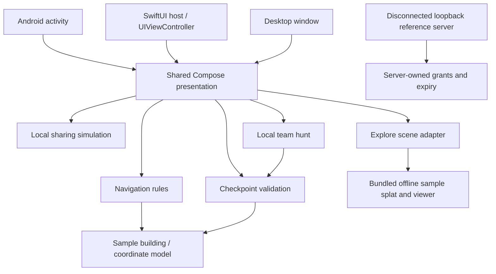

# Architecture

## Shape

The Android activity, SwiftUI iOS host and desktop window launch the same Compose application. The shared module groups code by feature: building, navigation, checkpoints, sharing, hunt and exploration. Domain behavior is plain Kotlin. Presentation depends on domain results; sample data supplies fictional building geometry. Tests mirror features under `commonTest`.

There is intentionally no edge from the app to the reference server. No camera, radio positioning, account provider, analytics or remote multiplayer adapter is implemented.

On Android and iOS, the application opens an interactive Explore scene, with a Map tab returning to the full-viewport fictional floor plan. Desktop opens the map and provides a separate loopback browser demo for Explore. Feature state is held above scene selection and panels, so switching views or dismissing panels preserves navigation, hunt progress and the local sharing grant. The presentation direction is recorded in [ADR 0003](adr/0003-map-first-interface.md) and [ADR 0004](adr/0004-gaussian-exploration-priority.md). Map geometry and route rules remain independent of this visual layout.

## Feature responsibilities

| Feature | Owns | Important behavior checks |
| --- | --- | --- |
| Building | Floors, rooms, geometry, stable IDs and sample fixtures | All rooms/checkpoints reference valid floors and route destinations |
| Navigation | Graph route choices, connector segments and map presentation | Cross-floor paths, stairs/lift choices, step-free exclusions, invalid destinations |
| Guide | Optional preview timeline over an existing route and pixel actor presentation | Distance-based progress, explicit floor transitions, pause/resume and arrival without changing last-seen observations |
| Checkpoints | Narrow payload validation and latest observation | Valid known checkpoint; wrong scheme/building/ID rejection; no update on rejection |
| Sharing | Local recipient consent, bounded duration and stop/expiry presentation | Allowed durations and exact deadline |
| Hunt | Team objective, ordered finds and contributions | Invalid/out-of-order/repeated checkpoints cannot advance progress |
| Exploration | Platform viewer adapter and separate sample scene identity | Offline bundle completeness, browser camera controls and return-to-map behavior |

The app state is in memory. It resets on restart. This is deliberate for the first experiment; lifecycle persistence and secure background sharing require separate decisions and tests.

The map draws a generated coworking-floor raster through a fixed image-to-world registration, shared with room hitboxes and corridor waypoints. The image is a presentation asset; explicit sample data owns navigation topology. All four floors reuse the illustration with distinct floor-qualified room IDs. The crop is 1488 × 872 pixels at an illustrative 20 pixels per metre, yielding 74.4 × 43.6 sample metres; this is not a building survey. Original generated floor/founder assets are shared Compose resources. The guide consumes calculated route legs and has no positioning or sharing dependency. See [asset provenance](assets/PIXEL_ART.md). Scene and map backgrounds fill the window; interactive overlays handle safe insets separately.

## Platform and dependencies

- Kotlin 2.3.20 and Compose Multiplatform 1.11.1. Both `composeApp` and the Android launcher apply the Compose compiler plugin: the launcher’s `setContent` lambda also needs transformation.
- Gradle 9.5.0 wrapper with Android Gradle Plugin 9.3.1; shared Android KMP library and separate Android application module.
- Compose resources package the pixel-art atlases across targets. The Android KMP target explicitly enables resources; verify the final APK and iOS app bundle, since successful compilation alone does not establish that artwork is packaged.
- Material 3 `1.11.0-alpha07` is pinned separately. It is a prerelease UI dependency; reevaluate before a production release and test upgrades across platforms.
- Explore bundles PlayCanvas `2.23.1` and a reduced CC BY 4.0 Gaussian-splat sample locally. Android's `WebViewAssetLoader` serves bundled assets from a local HTTPS origin; explicit full-size WebView layout parameters keep its HTML viewport aligned with Compose's bounded container; iOS uses `WKWebView` with app-bundle file access. Both keep a Map fallback in the shared shell. Desktop can serve the same viewer over loopback from `exploration/dist/`; the desktop app itself opens the 2D map.
- Android compile SDK 36, minimum API 26. iOS deployment target 16, ARM64 device and Apple Silicon simulator frameworks. Desktop uses the JVM.
- Plain constructor/function dependencies instead of a DI framework. Kotlin test for shared behavior; Python unittest for the disconnected server.

The current [official compatibility guide](https://kotlinlang.org/docs/multiplatform/multiplatform-compatibility-guide.html) and [Android KMP library guidance](https://developer.android.com/kotlin/multiplatform/plugin) inform configuration, but local verification is recorded separately. A dependency declaration is not proof a target has run.

## Reference server

`server/sharing/store.py` is a small behavioral interface: create, publish latest payload, read as a selected recipient, revoke and purge. A injected server clock allows exact-deadline tests. `http.py` authenticates temporary demo bearer tokens and maps HTTP to the store. It binds only to loopback and suppresses request logs. There is no database or historical position storage.

This Python standard-library experiment is intentionally independent of the Kotlin UI. A production backend remains undecided. See [ADR 0002](adr/0002-disconnected-sharing-reference.md) and [privacy design](PRIVACY.md).

## Extension points without speculative code

Gaussian exploration is a core product slice ([ADR 0004](adr/0004-gaussian-exploration-priority.md)). The current renderer is a bundled web viewer hosted in native app surfaces; the sample engine room is unrelated to the fictional building and has no room hotspots. Scene assets and camera state are separate from authoritative room/route data. Room-linked exploration would require permitted captures, surveyed alignment and verified IDs under the coordinate contract. The 2D view remains available during loading, errors and unsupported rendering. A separate WebXR client remains planned.

Real building import should preserve the coordinate and ID contract while validating geometry and graph connectivity. Camera scanning should return the same validated checkpoint payloads. Positioning hardware should produce observations with explicit accuracy and freshness, never silently replace last-seen semantics. Network sharing requires real identity and audited client cryptography before app transport is added. Future 3D clients consume the same building version and room IDs, while 2D remains available.

We use packages first, not a Gradle module per feature. Extract a module only when enforcing dependencies, separate ownership or build performance creates a concrete need. [ADR 0001](adr/0001-sample-first-shared-app.md) records this choice.
