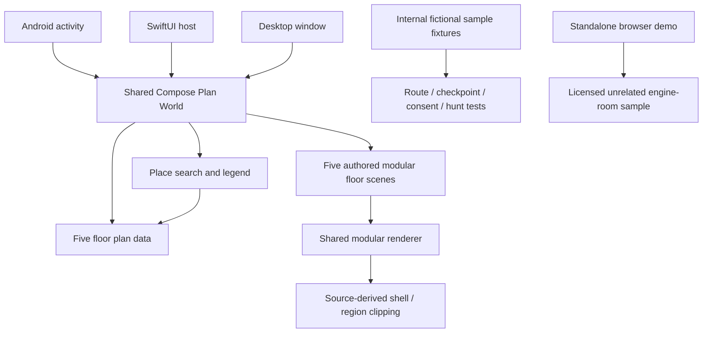

# Architecture

## Future game architecture — implementation deferred

The next direction is a standalone Godot game and a SvelteKit browser Studio, exchanging bounded, versioned room/character/quest content. PixiJS may remain the Studio canvas. Compose stays as the current app during evaluation; embedding or replacing it needs later evidence. Resident feedback, a revised PRD and explicit user resumption are required before scaffolding or migration. The [plan](plans/GODOT_SVELTEKIT.md) and [ADR 0008](adr/0008-godot-game-sveltekit-studio.md) explain the boundary and why SvelteKit is preferred over a Compose browser UI for this authoring workflow.

## Active shape

Android, iOS and desktop launch the shared Kotlin Multiplatform/Compose application. Its current home is **Plan World**, with five structured floor records, five authored modular floor-scene recipes rendered by one shared modular renderer. Scene data remains independent of Compose and source geometry; the renderer combines material patterns, reusable wall/window modules and individually cropped atlas assets. The building domain owns source-derived outer-footprint polygons, courtyard voids, places and plan-image badge centers; presentation clips content to the floor shell and transforms it for pan, zoom and Fit. Search and the accessible legend use the same place records. Marker labels wrap and use leader lines as needed, repeated positions retain their names, and offscreen labels are omitted. Geometry and search remain independent of Compose, operating systems and transport. Platform launchers stay thin; tests mirror feature packages under `commonTest`.

The plan world has a place guide, but its Directions view reports the selected floor and source plan position only; it has no entrance or route graph. It has no edge to sample routing, checkpoint observations, sharing, hunt or the standalone splat viewer. No camera, positioning radio, account provider, analytics, external location upload or multiplayer adapter is implemented for the plan world.

## Plan data and provenance

Each original plan is 2048 × 1448 pixels, X right and Y down. Active tracing lies approximately in X 80–1940, Y 580–1280. These values are source-art positions, not metric coordinates. Five independent datasets preserve differences in outer footprints and courtyard voids. The footprint masks are coarsely extracted from source pixels and simplified; they preserve relative shape, not exact wall dimensions. All five authored scene recipes use source-coordinate regions and are drawn by the shared renderer, clipped to the shell, assigned colored areas and stair reservations. The original full-floor PNGs remain historical references and are not active rendering inputs or fallback. All decorative partitions, desks, furniture and characters are fictional. On ground, the full silhouette remains visible in muted charcoal (#252B2D) with a subtle outline; unassigned grey areas remain plain without furniture. Courtyards remain empty dark voids. Ground/second grey and ground orange source areas have no confirmed occupant assignment; first-floor FARI is detached; fourth-floor 66 / The Sky has a legend entry but no source badge. One place may have multiple badge centers when the source repeats a number.

Numbered company marker centers follow the supplied source badges; the [company placement audit](assets/COMPANY_PLACEMENT_AUDIT.md) documents the 64 entries, repeated badges, occupants and source coordinates. Ground FARI's marker is region-supported rather than badge-supported. The bike icon is a separate unnumbered point in a west-side room whose supplied divider remains continuous. Source-plan images support these drawing references, the silhouette and courtyards, not surveyed topology or exact room assignment. Company anchors stay in source coordinates even if display corridors are widened for readability. The authored modular scenes create fictional interiors; their walls and contents are not source-plan facts. Scene recipes are editable in source code, not through an in-app floor editor. The plans' revision is unknown; future imported editions need explicit provenance and review. See [coordinates](COORDINATES.md) and [ADR 0006](adr/0006-plan-derived-pixel-world.md).

Place selection is represented separately from place identity so a tapped repeated marker can retain its exact source anchor. Search/directory selection uses the first anchor; an unplaced entry has none and stays at Fit. Presentation animates the selected point to zoom 2.6 above the guide sheet. `PlaceProfiles` classifies source-listed companies, meeting room 31 and other known places; optional mission, purpose, attributable extra text and HTTPS links remain separate from geometry. Missing content renders an explicit empty state. The character is an illustrative guide; there is no resident editor or publishing integration.

## Parked code and separate viewer

The earlier fictional `sample-building` fixture uses four floors, an illustrative metre coordinate system, a reused coworking raster and a route graph. Its route, optional guide, QR validation, local sharing and same-device hunt behavior remain in internal legacy fixtures/tests. They do not operate on the five real-plan drawings. The disconnected Python reference server still exercises grant authorization, server-clock expiry and revocation with synthetic opaque payloads; the app does not connect to it. Opaque storage is not E2EE.

The licensed Tugboat Bat engine-room splat and PlayCanvas viewer remain bundled offline, with the local browser demo under `exploration/dist/`. This sample is independent of BeCentral. The old mobile reception doorway and Map/3D switches are historical prototype behavior, superseded as the active entry by Plan World. The browser demo is not evidence of mobile performance or room-linked alignment. See [viewer provenance](../exploration/README.md) and [verification](testing/STATUS.md).

## Room Studio prototype

`room-studio/` is an independent Vite/PixiJS browser editor. Its pure JavaScript domain module validates scene JSON against a fixed convex chamfered room polygon, limits the furniture types and count, and rejects objects that extend outside that trusted boundary. It imports the shared starter fixture from Compose resources. Browser-only persistence uses local storage; export/import uses the versioned JSON schema. There is no server, account, sync, asset upload, AI generation or publishing path.

The Compose `features/studio` domain parses and validates the same schema and keeps the drawing model separate from UI. `RoomStudioPreview` loads the shared fixture and permits JSON paste/apply and reset in a transient preview state. Its edits are not persisted. Plan World reaches this preview from More. Neither the browser nor Compose fixture is linked to a real campus room or tenant record. The demo polygon is immutable in imported scenes, so Studio cannot change source floor geometry. See [ADR 0007](adr/0007-room-studio-experiment.md).

## Platform and dependencies

The project pins Kotlin 2.3.20, Compose Multiplatform 1.11.1, Gradle 9.5.0, Android Gradle Plugin 9.3.1 and Material 3 `1.11.0-alpha07`. Android targets API 26+ and compiles against 36. iOS targets 16+ with ARM64 device/Apple Silicon simulator frameworks. Compose resources package artwork; verify the target bundle and visible screen rather than inferring success from compilation. Plain constructors/functions suffice for dependencies; add a layer or module only for a concrete need. Browser Studio scripts run from `room-studio/`: `npm ci`, `npm test`, `npm run build`, and `npm run dev`.

## Future integration boundary

A real navigation import needs approved, versioned plans; stable room identities; surveyed entrances/connectors; accessibility evidence; and validation of graph connectivity. Source pixels cannot be converted into measured routes by assuming a scale. A room-linked 3D capture needs permitted assets and surveyed alignment. QR scanning, positioning and network sharing each require separate adapters and consent/security checks. Keep last-seen semantics distinct from live position, and keep no location history by default.
